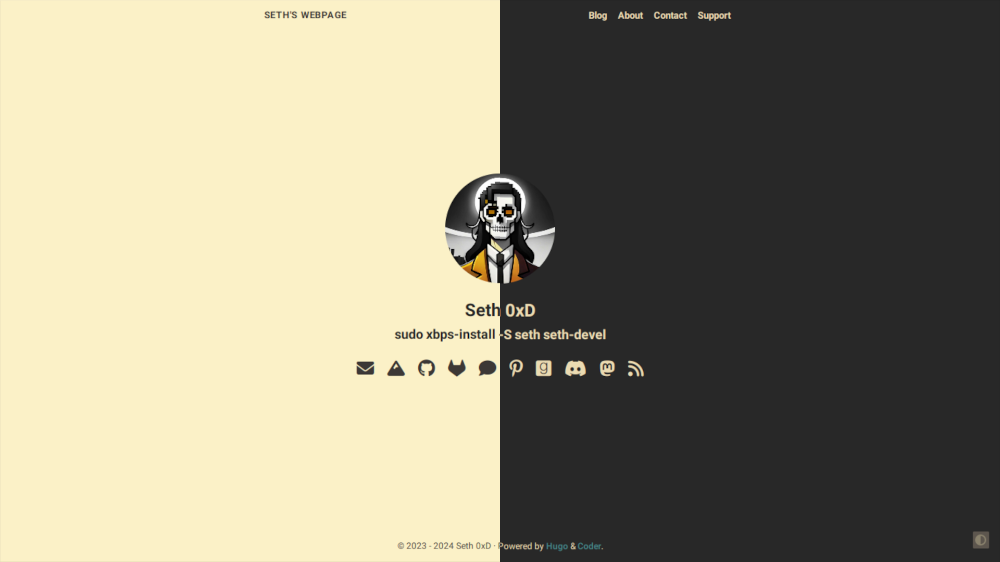

  

    
  

A Gruvboxed fork of [Coder](https://github.com/luizdepra/hugo-coder), A simple and clean blog theme for [Hugo](https://gohugo.io/).

## Live Demo

See [here](https://seth0xd.xyz/).

## Quick Start

1. Add the repository into your Hugo Project repository as a submodule, `git submodule add https://github.com/seth0xd/hugo-coder-gruvbox.git themes/hugo-coder-gruvbox`.
2. Configure your `hugo.toml`. You can either use [this minimal configuration](https://github.com/seth0xd/hugo-coder-gruvbox/blob/main/docs/configurations.md#complete-example) as a base, or look for a complete explanation about all configurations [here](https://github.com/seth0xd/hugo-coder-gruvbox/blob/main/docs/configurations.md). The [`hugo.toml`](https://github.com/seth0xd/hugo-coder-gruvbox/blob/master/exampleSite/hugo.toml) inside the [`exampleSite`](https://github.com/seth0xd/hugo-coder-gruvbox/tree/master/exampleSite) is also a good reference.
3. Build your site with `hugo server` and see the result at `http://localhost:1313/`.

## Documentation

See the [`docs`](docs/home.md) folder.

## License

Coder is licensed under the [MIT license](https://github.com/seth0xd/hugo-coder-gruvbox/blob/master/LICENSE.md).